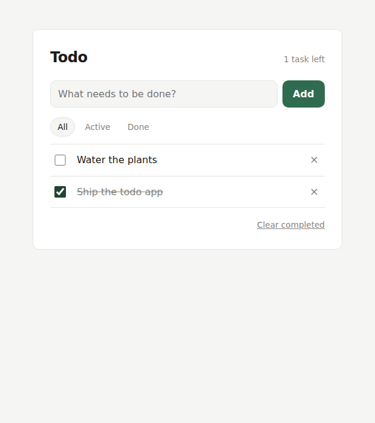

# HelloWorld

Hi Human, i'm new here

## Todo app

A small to-do list app. No build step, no dependencies — just open `index.html`
in a browser.

### What it does

- Add tasks, tick them off, delete them
- Click a task's text to edit it in place (Enter saves, Escape cancels, emptying it deletes the task)
- Filter by All / Active / Done, and clear all completed at once
- Tasks are saved in the browser's `localStorage`, so they survive a reload
- Light and dark theme, following the system setting

### Files

| File | Purpose |
| --- | --- |
| `index.html` | Page structure |
| `styles.css` | Styling and theming |
| `app.js` | State, storage, and rendering |
